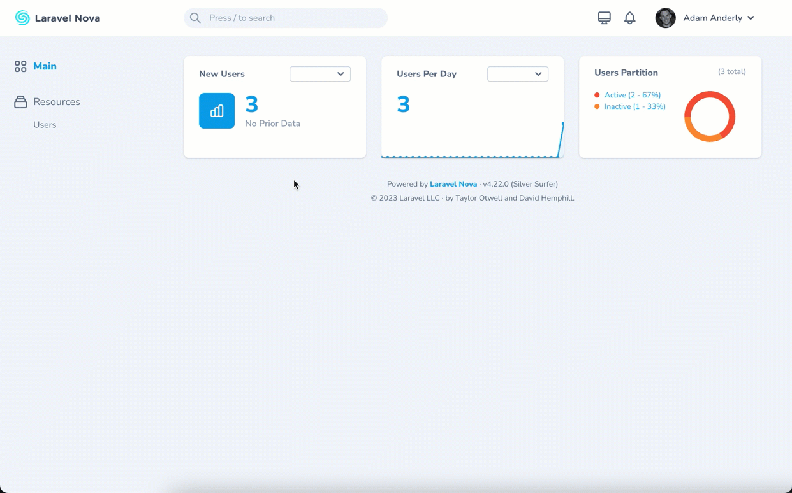

# Nova Linkable Metrics

[](https://packagist.org/packages/saintsystems/nova-linkable-metrics)
[](https://packagist.org/packages/saintsystems/nova-linkable-metrics)

Add custom links to your Laravel Nova metrics.



## Installation

You can install the package in to a Laravel app that uses [Nova](https://nova.laravel.com) via composer:

```bash
composer require saintsystems/nova-linkable-metrics
```

## Usage

To add the link ability to your Laravel Nova metric cards, you need to add the `Linkable` traits to your metrics.

For example, within your custom Nova value metric:
```php
    // App\Nova\Metrics\NewUsers.php

    use SaintSystems\Nova\LinkableMetrics\LinkableValue;

    class NewUsers extends Value
    {
        use LinkableValue;

        //...omitted for brevity

```

Within your custom Nova trend metric:
```php
    // App\Nova\Metrics\UsersPerDay.php

    use SaintSystems\Nova\LinkableMetrics\LinkableTrend;

    class UsersPerDay extends Trend
    {
        use LinkableTrend;

        //...omitted for brevity

```

Within your custom Nova partition metric:
```php
    // App\Nova\Metrics\UsersByStatus.php

    use SaintSystems\Nova\LinkableMetrics\LinkablePartition;

    class UsersByStatus extends Partition
    {
        use LinkablePartition;

        //...omitted for brevity

```

## Defining Metric Links

You can define metric links using the `route` method from the `Linkable` trait in one of two ways:

1. When the card is registered:

**Index Route**

```php
    // App\Nova\Dashboards\Main.php

    /**
     * Get the cards for the dashboard.
     *
     * @return array
     */
    protected function cards()
    {
        return [
            (new NewUsers)->width('1/3')->route('nova.pages.index', ['resource' => 'users']),
        ];
    }
```

**OR using a Lens Route**

```php
    // App\Nova\Lenses\UnverifiedEmail.php

    class UnverifiedEmail extends Lens
    {
        //... omitted for brevity

        public static function query(LensRequest $request, $query)
        {
            return $request->withOrdering($request->withFilters(
                $query->whereNull('email_verified_at')
            ));
        }

        //... omitted for brevity

        /**
         * Get the URI key for the lens.
         *
         * @return string
         */
        public function uriKey()
        {
            return 'unverified-email';
        }

    }

    // App\Nova\Dashboards\Main.php

    /**
     * Get the cards for the dashboard.
     *
     * @return array
     */
    protected function cards()
    {
        return [
            (new NewUsers)->width('1/3')->route('nova.pages.lens', ['resource' => 'users', 'lens' => 'unverified-email']),
        ];
    }
```

**OR using a Filter Route**

```php
    // App\Nova\Filters\UserStatus.php

    class UserStatus extends Filter
    {
        //... omitted for brevity

        /**
         * Apply the filter to the given query.
         *
         * @param  \Laravel\Nova\Http\Requests\NovaRequest  $request
         * @param  \Illuminate\Database\Eloquent\Builder  $query
         * @return \Illuminate\Database\Eloquent\Builder
         */
        public function apply(NovaRequest $request, $query, $value)
        {
            return $query->where('active', $value);
        }

        /**
         * Get the filter's available options.
         *
         * @param  \Laravel\Nova\Http\Requests\NovaRequest  $request
         * @return array
         */
        public function options(NovaRequest $request)
        {
            return [
                'Active' => '1',
                'Inactive' => '0'
            ];
        }
    }

    // App\Nova\Dashboards\Main.php

    /**
     * Get the cards for the dashboard.
     *
     * @return array
     */
    protected function cards()
    {
        $filter = base64_encode(json_encode([
            [
                'class' => UserStatus::class,
                'value' => '1',
            ],
        ]));

        return [
            (new NewUsers)->width('1/3')->route('nova.pages.index', ['resource' => 'users', 'users_filter' => $filter]),
        ];
    }
```

2. Or, within the card itself (useful for cards only available on detail screens where you might want to filter the url based on the current resource):

```php
    // In your linkable Nova metric class

    /**
     * Calculate the value of the metric.
     *
     * @param  \Illuminate\Http\Request  $request
     * @return mixed
     */
    public function calculate(Request $request, UnitOfMeasure $unitOfMeasure)
    {
        $result = $this->result($unitOfMeasure->items()->count());
        $params = [
            'resource' => 'items',
            'viaResource' => $request->resource,
            'viaResourceId' => $unitOfMeasure->id,
            'viaRelationship' => 'items',
            'relationshipType' => 'hasMany',
        ];
        return $result->route('nova.pages.index', $params);
    }
```

**Customizing Partition Links**

By default, Partition metrics can have links just like Value and Trend metrics. However, using the default `route` method like on Value and Trend metrics (as shown above) will simply link the PartitionMetric card title to the provided route/url.

For greater customization, you may pass a Closure to the new `link` method on the LinkablePartitionResult class that allows you to customize the link for each individual partition in the generated chart, and even pass partition information to the route like below:

```php
    // App\Nova\Metrics\UsersByStatus

    use SaintSystems\Nova\LinkableMetrics\LinkablePartition;

    class UsersByStatus extends Partition
    {
        use LinkablePartition;

    /**
     * Calculate the value of the metric.
     *
     * @param  \Laravel\Nova\Http\Requests\NovaRequest  $request
     * @return mixed
     */
    public function calculate(NovaRequest $request)
    {
        return $this->count($request, User::class, 'active')
            ->label(fn ($value) => match ($value) {
                1 => 'Active',
                0 => 'Inactive'
            })
            ->link(fn ($value) => match ($value) {
                // 1 => null,
                default => route('nova.pages.index', ['resource' => 'users', 'users_filter' => base64_encode(json_encode([
                    [
                        'class' => UserStatus::class,
                        'value' => $value,
                    ],
                ]))], false)
            });
    }

    // ... omitted for brevity
```

## Credits

- [Adam Anderly](https://github.com/anderly)
- [Saint Systems](https://github.com/saintsystems)
- [All Contributors](../../contributors)

## License

The MIT License (MIT). Please see [License File](LICENSE.md) for more information.
